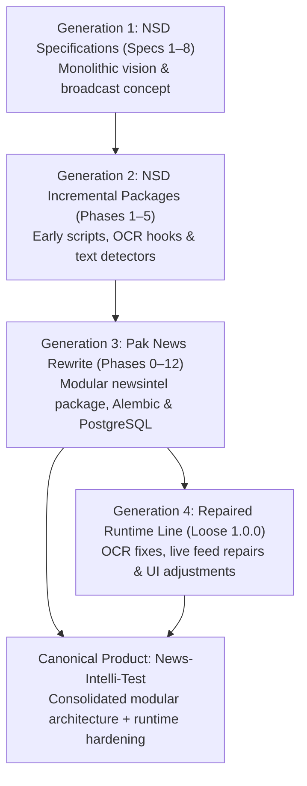

# Project Lineage & Provenance

This document records the architectural lineage and evolutionary generations of **News-Intelli-Test** (formerly *Pakistani News Stream Intelligence* / *News Statement Detection System*). It serves as the authoritative public history explaining how the project developed across distinct historical iterations.

---

## Evolution Generations

The project evolved across four major historical generations before being consolidated into the current canonical repository:

### Generation 1: News Statement Detector (NSD) Specifications (Revisions 1–8)
The project began as an initiative to detect and monitor televised political and news statements (*bayaanat*) from Pakistani television broadcasts. The early specifications (`news-statement-detection-system-spec(1)` through `(8)`) laid out the foundational requirements:
- Continuous capture of news crawls and broadcast tickers.
- Bilingual (Urdu and English) Optical Character Recognition (OCR).
- Attribution of political statements to speakers and public figures.
- Relational persistence and deduplication across broadcast channels.

### Generation 2: NSD Implementation Line (Phases 1–5 and Distribution Variants)
The first wave of implementation produced incremental packages (`NewsStatementDetector-Phase1.zip` through `Phase5.zip`), followed by multiple release candidates labeled `Final`, `Complete-Fixed`, `Final-Updated`, and `Simplified`. These early packages explored:
- Early EasyOCR and OpenCV frame processing scripts.
- Initial SQLite/PostgreSQL schema designs.
- Flat monolithic script architectures for video ingestion and text matching.

### Generation 3: The Pak News Modular Rewrite (Phases 0–12)
Recognizing the limitations of flat monolithic scripts, a major architectural rewrite was executed across 13 numbered milestones (`pak-news-intelligence-phase-0` through `phase-12-python-3.12.zip`):
- Established the modular `backend/newsintel` package structure.
- Introduced strict relational persistence via 30 normalized PostgreSQL tables.
- Implemented Alembic database migrations up to revision `20260720_0006`.
- Integrated transactional outbox messaging for reliable WebSocket event delivery.
- Built a modular React 19 + Vite dashboard with translation patching and signed pagination.
- Added comprehensive unit and contract test suites.

### Generation 4: Loose Repaired Runtime Line (1.0.0 Repair Snapshots)
Following the Phase 12 release, localized debugging and operational fixes were conducted on extracted monolithic runners (`app(2–4).py`, `pipeline(2–4).py`, `App(1–3).jsx`):
- Addressed PaddleOCR CPU runtime threading and memory behavior on Windows.
- Repaired live streaming reconnection and stream buffer backpressure.
- Tested alternative live event delivery via Server-Sent Events (`/api/live`).
- Refined UI styling, color contrast, and ticker animation buffering.

---

## Baseline Selection: Why Phase 12 Modular Architecture?

During the forensic recovery audit, two candidate paths were evaluated:
1. **The Loose 1.0.0 Monolithic Line**: Contained recent operational fixes but discarded modularity, test suites, Alembic migrations, and relational guarantees.
2. **Phase 12 Modular Architecture**: Retained strict modular design, 30 relational migrations, transactional outbox integrity, test fixtures, and comprehensive test coverage.

**Decision**: The project adopted **Strategy B with controlled integration**:
- The **Phase 12 modular architecture** was selected as the foundational structural baseline.
- Verified operational fixes from the loose 1.0.0 line (PaddleOCR CPU thread controls, media frame handling, and responsive CSS styling) were ported directly into `backend/newsintel` and `frontend/src`.
- The coherent `/api/v1` REST contract and transactional outbox-backed WebSocket (`/api/v1/ws/live`) were validated and retained as canonical.

---

## Archival Separation

To preserve historical provenance without burdening the active product codebase:
- **Public Product Repository** (`mhyahya854/News-Intelli-Test`): Contains the clean, verified, production-ready codebase, migrations, tests, and current documentation.
- **Private Historical Archive** (`mhyahya854/News-Intelli-Test-Archive`): Preserves raw historical specifications, phase zip packages, execution transcripts, and forensic recovery manifests byte-for-byte under cryptographic SHA-256 verification.
